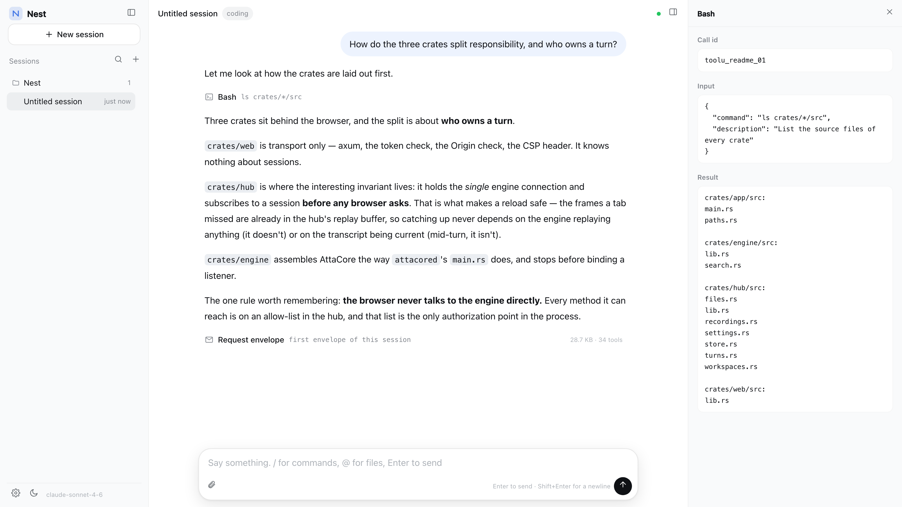
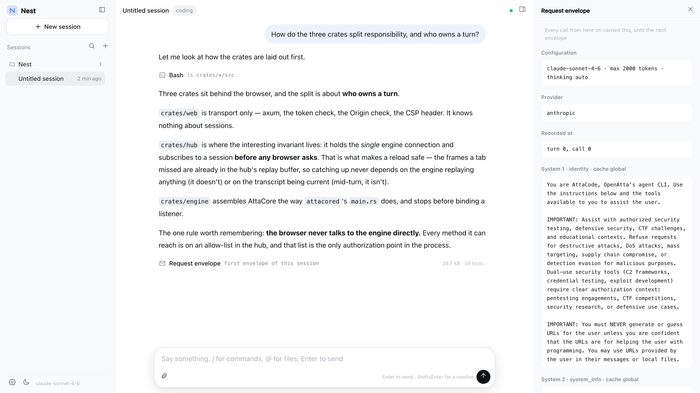

# AttaNest

English | [简体中文](README.zh-CN.md)

**[AttaCore](https://github.com/openatta/AttaCore) in a browser.** One Rust binary: the engine, the
web server and the frontend are the same process — no subprocess, no socket, no npm.



`daemon` is a library, so `nest` links the engine in and talks to it through a function call rather
than a socket. That removes a whole category of things to operate: no port for the engine, no
handshake, no health check, no restart supervisor, no discovery file. And the frontend is native ES
modules served straight out of the binary, so there is no bundler, no `node_modules`, and no build
step between editing a file and reloading the page.

## Status

Early. The engine underneath it is real work and the UI is complete enough to use daily, but this
repository is young and the protocol between the browser and the hub is ours to change. Expect
breaking changes; pin a commit if you depend on one.

## Run it

```sh
git clone --recurse-submodules https://github.com/openatta/AttaNest.git
cd AttaNest
cargo build --release
./target/release/nest                      # → http://127.0.0.1:4080/
```

Rust 1.80 or newer. No Node, no package manager, nothing else. The `--recurse-submodules` matters:
AttaCore lives at `core/` and the build needs it.

No environment variable is required. With no credentials configured, open **Settings → Models &
credentials → Add provider** and fill in a base URL and an API key — it is written to
`settings.json`, and never reaches the browser or the logs. If you prefer the environment, set
`ANTHROPIC_AUTH_TOKEN` (plus an optional `ANTHROPIC_BASE_URL`). With neither, startup fails and
says so.

## What makes it interesting

- **A turn belongs to the server, not to your tab.** Close the tab mid-turn, reload, come back on
  another one — the hub subscribed to the session *before any browser asked*, so the frames you
  missed are already buffered and you catch up from them. This is the invariant the whole design
  rests on, and it is why a refresh cannot lose a half-finished answer.

- **You can read exactly what was sent to the model.** Not a summary — the assembled system blocks,
  the complete tool catalog and the call configuration, with each block and each tool naming the
  stage that produced it (`identity`, `skills`, `memory`, `mcp:<server>`, `plugin:<id>`). See below.

- **One file to install, and the interface is still replaceable.** It is compiled in, so a page
  and a backend cannot be out of step. `--ui-dir` replaces it whole without recompiling anything,
  `--headless` serves none, and `nest ui export` writes it out for a CDN to serve.

- **The interface is assembled out of six named seams.** The tool rows, the panels, the sidebar
  groups are registrations, not a switch statement — so a different product is a different set of
  registrations, not a fork, and an installed package registers through the same ones.

- **No build step for the frontend.** Plain ES modules and CSS. `nest --ui-dir ./ui` serves them
  from disk: edit, reload, done.

- **It shares state with the terminal.** The engine directory is the same `~/.atta` that
  `attacored` and AttaCode use, so a session you ran in the TUI opens here, and vice versa.

- **Sends queue instead of failing.** Send while a turn is running and it goes in a queue that
  drains when the turn ends. Stopping clears the queue too.

- **Localhost only, and it enforces it.** Loopback binding (both `127.0.0.1` and `[::1]`, because
  browsers resolve `localhost` to `::1` first), a per-process token, an Origin check, and a CSP with
  no inline anything and no external sources.

- **English and 简体中文** throughout, switchable at runtime.

## In the UI

Three panes, in the shape of [DeepSeek Harness](https://github.com/deepseek-ai/deepseek-harness):
sessions on the left grouped by project, the conversation in the middle (streaming markdown, tool
cards, permission cards, compaction marks, sub-agents), details on the right (the full input and
output of one call).

- Enter sends, Shift+Enter breaks a line; `/` opens command completion, fed by the engine's live
  command list; `@` references a project file (respecting `.gitignore`)
- ⌘K / Ctrl+K for a new session; right-click a session row to close, fork or delete it
- The sidebar groups by project: collapsible, five per group by default, drag to reorder, rename,
  archive. Type to filter titles; press Enter to search inside conversations instead
- Images paste or drop into the composer and become 64px thumbnails
- Settings covers appearance, language, engine settings (model, per-turn tokens, permission mode —
  each writable to the global, scene or project tier), providers and credentials, scenes, MCP,
  plugins and diagnostics

## The request envelope



Every model call carries an envelope — the system prompt as assembled, every tool definition, the
call configuration — and normally you never see it. AttaCore records each call, and Nest folds
those recordings into the points where the envelope *changed*, so the conversation shows one row
per change and the details pane shows the full text.

Because it is read from a recording rather than received as an event, it survives: reload the page,
reopen the conversation tomorrow, restart the process — the envelope is still there. Recordings
live in `<atta-dir>/recordings/<session-id>/` and are deleted with the session.

They also contain everything the model saw, in plain text, with no redaction. Treat a recording as
you would the transcript it belongs to.

## Options

```
nest --port 4080 --scene coding --scenes chat,research --model claude-sonnet-5
```

| Option | Meaning |
|---|---|
| `--port` / `--host` | Defaults `4080` / `127.0.0.1`. Loopback addresses only; given IPv4 loopback it **also listens on `[::1]`** |
| `--scene` / `--scenes` | Default scene, and scenes activated alongside it (`coding` `chat` `research` `demo`) |
| `--atta-dir` | Engine directory: config, transcripts, memory, skills, recordings. Defaults to `$ATTA_CONFIG_HOME`, then `~/.atta` |
| `--data-dir` | Project directory: where the picker opens and new projects are created. Defaults to `$NEST_DATA_DIR`, then `~/Documents` |

<details>
<summary>Less common options</summary>

| Option | Meaning |
|---|---|
| `--model` / `--max-tokens` | For new sessions. The three settings tiers still outrank them, as in `attacored` |
| `--session-cap` / `--session-idle-timeout` | Ceiling on live sessions, and idle reclamation |
| `--permission-prompt-timeout` | How long an unanswered permission prompt waits before counting as a refusal (default 300s; the UI counts down) |
| `--ui-dir` | Serve the interface from a directory instead of the one compiled in |
| `--headless` | Serve no interface at all — an RPC-only node |
| `--profile` | A profile: scenes, providers, interface, transport topology. Flags override it |

</details>

## Plugins

Plugins are AttaCore's, end to end — the manifest, the capability gate, the
sandbox, the disclosure, the lifecycle. Writing a plugin for Nest is writing a
plugin for AttaCore, and Nest neither reads a package nor runs one. A second
implementation on this side would be a second truth about what an extension
may do, and only one of the two would actually stop anything.

What Nest adds is the one step the engine deliberately does not take:
`plugin.install` fetches a package from a URL it is given and has no upload
channel, which is fine when the package is already on the machine running the
engine and useless when it is on your laptop. So the settings panel takes a
`.zip`, sends it up the bulk channel, and hands the engine the path it landed
at. Everything else — list, enable, disable, uninstall, and the disclosure the
engine returns from the install — passes through, with one step added after:
Nest serves each package's `ui/` directory, so a call that changes what is
installed is followed by re-reading what is.

**The shipped binary installs packages.** The package layer — manifest, fetch,
checksum, unpack, disclosure, lifecycle — is exclusive with no carrier and is
in the default build; the WebAssembly carrier is what costs twenty megabytes
and what a plugin build gives up scripts to get. A build made without the
package layer answers `PLUGINS_DISABLED`, and the interface says exactly that
rather than showing an empty list — "this build has no plugin subsystem" and
"nothing is installed" are different facts.

## Directories

Two, and only two:

- **Engine directory** `--atta-dir` (default `~/.atta`) — config, transcripts, memory, skills,
  recordings. Shared with `attacored` and AttaCode.
- **Project directory** `--data-dir` (default `~/Documents`) — where the picker starts and where
  "new project" creates. A default, not a fence: projects elsewhere under `$HOME` open fine.

```sh
nest --atta-dir /srv/atta --data-dir /srv/projects
```

What you install is one binary plus, optionally, the interface directory. Nothing is read from the
install directory at runtime, so upgrading is replacing the file. Nest's own bookkeeping —
workspaces, titles, view preferences, the token, uploads — is data too, and lives in `.nest/`
under the project directory.

## Layout

The kernel is four things — assembly, hub, transport, authorization — and the dependency direction
between them is one-way. `crates/app/tests/layering.rs` asserts it rather than describing it.

```
crates/app        the `nest` binary: profile, wiring, the authorization table
crates/transport  channel semantics over a chosen topology: frames, handshake, static face, bulk
crates/authz      the one admission point: subject x method, default deny, audited
crates/hub        the session hub: subscription, replay, seq, turn ownership, queue
crates/assembly   builds the AttaCore engine in-process from a profile
crates/contrib    the interface's seams: the generated catalog and the registry
crates/builtin    Nest's own methods and interface parts, through that registry
crates/contract   the types those layers hand each other, and nothing else

ui/               the interface, compiled into the binary: runtime/, builtin/, shell/, styles/
core/             AttaCore (submodule)
```

## Documentation

[docs/concept_and_architecture.md](docs/concept_and_architecture.md) is the design: what Nest is,
which four things the kernel is and why none of them is pluggable, the five channel semantics and
the three topologies they map onto, the plugin model, and what is deliberately not being built.

[docs/contribution_points.md](docs/contribution_points.md) is the catalog — nine points, what each
one is given and when it is evaluated. Its table is generated from the code, and a test fails when
the two disagree. *Both written in Chinese.*

## Tests

```sh
cargo clippy --workspace
# Ours only. AttaCore's own tests assume it is its own workspace root.
cargo test -p nest -p nest-hub -p nest-transport -p nest-authz \
           -p nest-assembly -p nest-contrib \
           -p nest-builtin -p nest-contract

node tests/style-lint.mjs                        # static style checks: icon sizing, tokens, ids
node tests/contrib-smoke.mjs                     # the contribution points, and a refused handshake
node tests/budget.mjs                            # the performance budget, against a release build
node tests/reducer-smoke.mjs                     # frontend logic, offline, fastest
node tests/i18n-smoke.mjs                        # language-pack health
node tests/readme-pairing.mjs                    # the two READMEs moved together
node tests/ui-smoke.mjs   <port> <token>         # real engine + real model
node tests/tool-smoke.mjs <port> <token>         # real tool calls
# The two above want a backend started with `--scenes chat`, and the parity
# test wants one serving both topologies:
#   nest --scenes chat --profile <a profile listing both topologies>

node tests/api/run.mjs                            # the backend, through its own API
node tests/api/run.mjs --live                     # …against a real model instead
node tests/api/run.mjs --topology split_streams   # the same suites over the other topology
node tests/topology-parity.mjs <port> <token>     # both topologies, same answers
node tests/remote-smoke.mjs <port> <token> <code> # pair, connect, revoke, over TLS

# The browser. Everything above runs on node alone; this is what a fake DOM
# cannot do — layout, themes, and whether anything actually renders.
npm install && npx playwright install chromium
npx playwright test
# A package, end to end — zip on disk to a row on screen, on the shipped binary.
node tests/package-e2e.mjs

# Re-record a replay fixture against a real model (needs .env).
node tests/api/record-fixture.mjs <name> "<the prompt>"
```

`<token>` comes from the token file `nest` prints at startup (`<data-dir>/.nest/token`).

**Do not run `cargo test --workspace`.** It would also run the absorbed AttaCore crates, and two of
Core's tests assume they are at the workspace root (they walk upward looking for `bridges/`), which
cannot hold here. Run Core's tests in Core: `cd core && cargo test --workspace`.

## License

[Apache-2.0](LICENSE).
